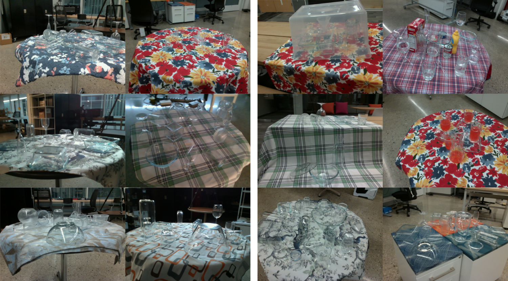
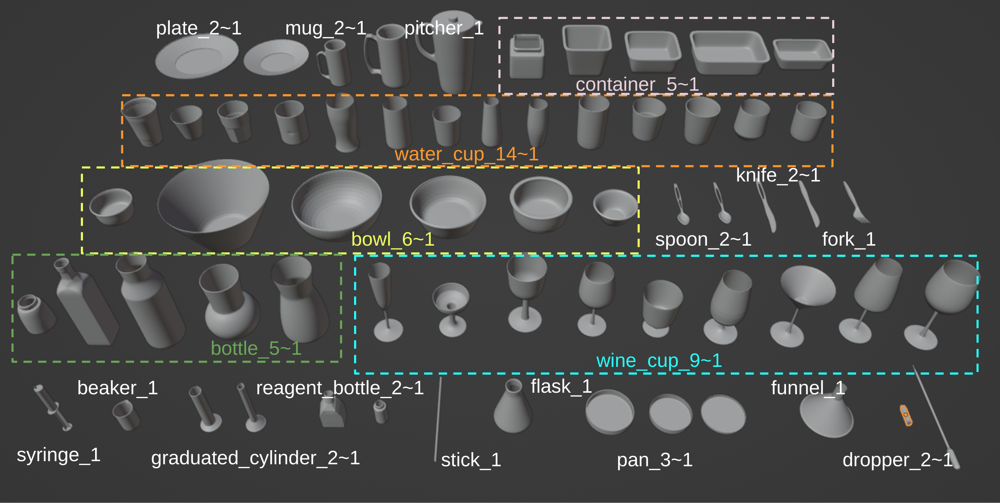

# ClearPose

This is the official repository of paper ['ClearPose: Large-scale Transparent Object Dataset and Benchmark'](https://progress.eecs.umich.edu/projects/clearpose/) in ECCV 2022. ([ArXiv](https://arxiv.org/abs/2203.03890), [Video](https://www.youtube.com/watch?v=i8LjxicAaps))



## Dataset

Google drive [link](https://drive.google.com/drive/folders/1Cp2cwwQmntE0aUkmHOLKIlG4Jiz9PQH8?usp=sharing)

ClearPose dataset is captured using RealSense L515 camera in indoor environments over 63 transparent objects. It contains RGB, raw depth, ground truth depth (generated by overlapping rendered objects' depth over raw depth), ground truth surface normal (calculated from ground truth depth) images, and all the object instance 6D poses. The data annotation is accomplished with the tool [ProgressLabeler](https://github.com/huijieZH/ProgressLabeller), which includes ORB-SLAM3 to solve camera trajectory, a Blender interface for object poses, and backend renderer to generate data. The objects' geometry models are manually created in Blender and verified during the annotation process. We also include models of opaque objects (from [YCB](https://www.ycbbenchmarks.com/object-models/) and [HOPE](https://github.com/swtyree/hope-dataset) datasets) appeared in some scenes. The object names are defined as shown in the image below (also provided in the blender scene file in object model zip folder).



ClearPose is separated into 9 sets. Set1 includes chemical transparent objects only, Set2-7 include household objects only, and Set8-9 also include other adversarial factors. Among Set2-7, Set2 and Set3 includes almost twice the objects as Set4-7, appeared to have heavy clutters. Objects in Set2 are divided into Set4 and Set5, and objects in Set3 are divided into Set6 and Set7.

Each set includes 5-6 scenes. For Set1-7, the difference is only on backgrounds of transparent objects. We used one scene as validation/testing set and others as training set. For Set8 and Set9, we include 4 types of adversarial conditions, each with 3 scenes (for Set8 we have scene1-6, for Set9 we have scene7-12):

With opaque distractor objects: Set8_scene1-3;<br>
With colored liquid inside containers: Set8_scene6, Set9_scene9,10;<br>
Non-planar cases (Set1-7 are all captured on flat tabletop): Set8_scene5, Set9_scene11,12;<br>
With a translucent box cover: Set8_scene4, Set9_scene7,8.

The folder structure is as follows:

```bash
<dataset_path>
|-- set1
    |-- scene1
        |-- metadata.mat            # 
        |-- 000000-color.png        # RGB image
        |-- 000000-depth.png        # Raw depth image
        |-- 000000-depth_true.png   # Ground truth depth image
        |-- 000000-label.png        #
        |-- 000000-normal_true.png  #
        ...
|-- model
    |-- <object1>
        |-- <object1>.obj
    |-- <object2>
        |-- <object2>.obj
        ...
```

The ``metadata.mat`` file contains the annotations for each scene. For every single frame in the scene, it includes the following data:<br>
```
cls_indexes: object ID, n*1 matrix (n = number of visible objects)
camera_intrinsics: [[fx, 0, cx], [0, fy, cy], [0, 0, 1]], 3*3 matrix
rotation_translation_matrix: camera pose matrix [R|t], 3*4 matrix
center: n*2
factor_depth: 1000
bbox: n*4
```

## Benchmark experiments

We benchmarked two vision tasks, single image depth completion and object pose estimation, using end-to-end deep networks trained on the ClearPose dataset. For depth completion, we benchmarked ImplicitDepth and TransCG. For object pose estimation, we benchmarked [Xu et al.](https://www.mdpi.com/1424-8220/20/23/6790) (this method is not open-source and we implemented it based on the original paper) and [FFB6D](https://github.com/ethnhe/FFB6D). FFB6D is an RGB-D based pose estimation method, and we compare its performance with raw, completed depth from TransCG, and ground truth depth.

As different deep networks might have different working python environments, we separate them to different branches. For each of them, most of network training and inference source code is the same as their original repository, while we added customized dataloader and evaluation code for our dataset. To reproduce and develop based on our code, please refer to README in specific branches.

## Citation

If you find this project relevant for your work, please consider citing the paper.

```
@inproceedings{chen2022clearpose,
  title={ClearPose: Large-scale Transparent Object Dataset and Benchmark},
  author={Chen, Xiaotong and Zhang, Huijie and Yu, Zeren and Opipari, Anthony and Jenkins, Odest Chadwicke},
  booktitle={European Conference on Computer Vision},
  year={2022}
}
```

## Frequently Asked question
 1. Materials for objects 
    <details><summary>object material table</summary>

    |      object name     | material |
    |:--------------------:|----------|
    |       beaker_1       |   glass  |
    |       dropper_1      |  plastic |
    |       dropper_2      |  plastic |
    |        flask_1       |   glass  |
    |       funnel_1       |  plastic |
    | graduated_cylinder_1 |   glass  |
    | graduated_cylinder_2 |  plastic |
    |         pan_1        |  plastic |
    |         pan_2        |  plastic |
    |         pan_3        |   glass  |
    |   reagent_bottle_1   |   glass  |
    |   reagent_bottle_2   |  plastic |
    |        stick_1       |   glass  |
    |       syringe_1      |  plastic |
    |       bottle_1       |   glass  |
    |       bottle_2       |   glass  |
    |       bottle_3       |   glass  |
    |       bottle_4       |   glass  |
    |       bottle_5       |   glass  |
    |        bowl_1        |   glass  |
    |        bowl_2        |   glass  |
    |        bowl_3        |   glass  |
    |        bowl_4        |   glass  |
    |        bowl_5        |   glass  |
    |        bowl_6        |   glass  |
    |      container_1     |   glass  |
    |      container_2     |   glass  |
    |      container_3     |   glass  |
    |      container_4     |   glass  |
    |      container_5     |   glass  |
    |        fork_1        |  plastic |
    |        knife_1       |  plastic |
    |        knife_2       |  plastic |
    |         mug_1        |   glass  |
    |         mug_2        |   glass  |
    |       pitcher_1      |  plastic |
    |        plate_1       |   glass  |
    |        plate_2       |   glass  |
    |        spoon_1       |  plastic |
    |        spoon_2       |  plastic |
    |      water_cup_1     |   glass  |
    |      water_cup_3     |  plastic |
    |      water_cup_4     |   glass  |
    |      water_cup_5     |   glass  |
    |      water_cup_6     |   glass  |
    |      water_cup_7     |   glass  |
    |      water_cup_8     |   glass  |
    |      water_cup_9     |   glass  |
    |     water_cup_10     |   glass  |
    |     water_cup_11     |   glass  |
    |     water_cup_12     |   glass  |
    |     water_cup_13     |  plastic |
    |     water_cup_14     |  plastic |
    |      wine_cup_1      |   glass  |
    |      wine_cup_2      |   glass  |
    |      wine_cup_3      |   glass  |
    |      wine_cup_4      |   glass  |
    |      wine_cup_5      |   glass  |
    |      wine_cup_6      |   glass  |
    |      wine_cup_7      |  plastic |
    |      wine_cup_8      |  plastic |
    |      wine_cup_9      |   glass  |

    </details>
## License

Licensed under MIT License
